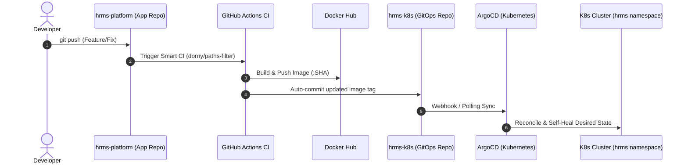

# ☸️ HRMS Kubernetes GitOps & Infrastructure

[](https://kubernetes.io/)
[](https://helm.sh/)
[](https://argoproj.github.io/cd/)
[](https://kubernetes.github.io/ingress-nginx/)
[](https://prometheus.io/)

This repository hosts the **declarative Kubernetes manifests, GitOps continuous delivery pipelines, universal Helm chart architecture, and observability configuration** for the HRMS microservices ecosystem.

---

## 🚀 End-to-End GitOps Architecture



---

## ⛵ Universal Parameterized Helm Chart (`charts/microservice`)

Rather than authoring and maintaining **30+ repetitive YAML files** across 10 individual microservices, this repository features an **enterprise, reusable Helm chart** (`charts/microservice`) that dynamically adapts to each service's requirements via modular values files.

### 📁 Values Architecture (`charts/values/`)

| Service Values File | Target Port | Features Configured |
| :--- | :---: | :--- |
| **[`department-service.yaml`](charts/values/department-service.yaml)** | `8083` | MySQL ConfigMap, Database Secret, Actuator Probes |
| **[`auth-service.yaml`](charts/values/auth-service.yaml)** | `8081` | MySQL ConfigMap, Database Secret, JWT Config |
| **[`employee-service.yaml`](charts/values/employee-service.yaml)** | `8082` | MySQL ConfigMap, Database Secret, **HorizontalPodAutoscaler (HPA)** |
| **[`attendance-service.yaml`](charts/values/attendance-service.yaml)**| `8084` | MySQL ConfigMap, Database Secret |
| **[`leave-service.yaml`](charts/values/leave-service.yaml)** | `8085` | MySQL ConfigMap, Database Secret |
| **[`payroll-service.yaml`](charts/values/payroll-service.yaml)** | `8086` | MySQL ConfigMap, Database Secret |
| **[`service-registry.yaml`](charts/values/service-registry.yaml)** | `8761` | **Zero-ConfigMap Mode**, Pure Eureka Discovery |
| **[`api-gateway.yaml`](charts/values/api-gateway.yaml)** | `8080` | **Service Port Mapping (`80` ➡️ `8080`)**, Eureka URL |
| **[`scheduler-service.yaml`](charts/values/scheduler-service.yaml)** | `8088` | **Gmail SMTP Secret Generator**, Cron Job ConfigMap |
| **[`notification-service.yaml`](charts/values/notification-service.yaml)** | `8087` | **Gmail SMTP Secret Generator**, Logging ConfigMap |

### 💡 Advanced Helm Chart Capabilities:
* **Conditional ConfigMaps:** Omitted completely if a service has no environment configuration (`service-registry`).
* **Conditional HPAs:** Automatically scales pods (1 to 5 replicas @ 70% CPU) when `autoscaling.enabled: true`.
* **Dynamic Secret Generation & Injection:** Securely provisions credential secrets (`scheduler-secret`, `notification-secret`) and mounts them into container environment variables.
* **Smart Health Probes & Resource Tiers:** Defaults to `1000m` CPU limits and `768Mi` memory to eliminate JVM startup throttling, backed by configurable `failureThreshold: 60` startup probes.

---

## 🌐 Ingress-NGINX & SSL/TLS Routing

External ingress traffic is managed through the Kubernetes Ingress-NGINX Controller with custom domain resolution and TLS termination.

* **Ingress Configuration:** [`infra/ingress/api-gateway-ingress.yaml`](infra/ingress/api-gateway-ingress.yaml)
* **Local Domain:** `https://myapp.local`
* **TLS Secret:** `myapp-tls` (Self-signed development certificates in `infra/ingress/crets/`)

### Traffic Routing Flow:
```text
https://myapp.local/actuator/health  ➡️ Ingress-NGINX (443) ➡️ api-gateway:80 ➡️ /actuator/health (200 UP)
https://myapp.local/api/departments ➡️ Ingress-NGINX (443) ➡️ api-gateway:80 ➡️ department-service:8083 (401/200)
```

---

## 📊 Cloud-Native Observability

Microservice performance and container health are continuously collected using the CoreOS Prometheus Operator:

* **Micrometer Actuator:** Spring Boot endpoints emit Prometheus-compatible metrics on `/actuator/prometheus`.
* **ServiceMonitor:** [`monitoring/servicemonitors/springboot-monitor.yaml`](monitoring/servicemonitors/springboot-monitor.yaml) automatically discovers and scrapes every Kubernetes service labeled `metrics: enabled`.
* **Grafana Dashboards:** Ready for JVM Micrometer dashboards (e.g., Dashboard ID `4701` / `11378`) tracking Heap/Non-Heap memory, GC pauses, CPU utilization, and HTTP request throughput.

---

## 🐙 GitOps with ArgoCD

All application states are declaratively managed through ArgoCD:

* **Self-Healing & Drift Detection:** Prevents manual configuration drift on the cluster by continuously reconciling against the `main` branch.
* **Automated Pruning:** Automatically garbage-collects orphaned Kubernetes resources upon deletion from Git.

---

## 📁 Repository Directory Structure

```text
hrmls-k8s/
├── apps/                         # Raw Kubernetes manifests (Deployments, Services, Configs)
│   ├── api-gateway/
│   ├── attendance-service/
│   ├── auth-service/
│   ├── department-service/
│   ├── employee-service/
│   ├── leave-service/
│   ├── notification-service/
│   ├── payroll-service/
│   ├── scheduler-service/
│   └── service-registry/
├── charts/                       # Reusable Parameterized Helm Architecture
│   ├── microservice/             # Core Chart (Deployment, Service, ConfigMap, HPA, Secret)
│   │   ├── Chart.yaml
│   │   ├── values.yaml           # Global production defaults
│   │   └── templates/
│   └── values/                   # 10 Microservice-Specific Values Files
├── infra/                        # Infrastructure components
│   ├── ingress/                  # Ingress-NGINX rules & TLS certificates
│   ├── mysql/                    # Shared database deployments & PVCs
│   └── namespace/                # Namespace definitions
└── monitoring/                   # Observability manifests & ServiceMonitors
    └── servicemonitors/
```

---

## 🛠️ Deployment & Usage Commands

### Test-Render a Service Manifest with Helm
```bash
# Preview generated Employee Service manifests (includes HPA)
helm template employee-service charts/microservice -f charts/values/employee-service.yaml -n hrms

# Preview generated Scheduler Service manifests (includes SMTP Secret)
helm template scheduler-service charts/microservice -f charts/values/scheduler-service.yaml -n hrms
```

### Install a Microservice using Helm
```bash
helm install department-service charts/microservice -f charts/values/department-service.yaml -n hrms
```

### Apply Ingress Routing
```bash
kubectl apply -f infra/ingress/api-gateway-ingress.yaml
```

---

## 🔗 Related Repositories

* **[hrms-platform](https://github.com/satheesh012/hrms-platform):** Multi-module Spring Boot application source code and GitHub Actions CI/CD workflows.